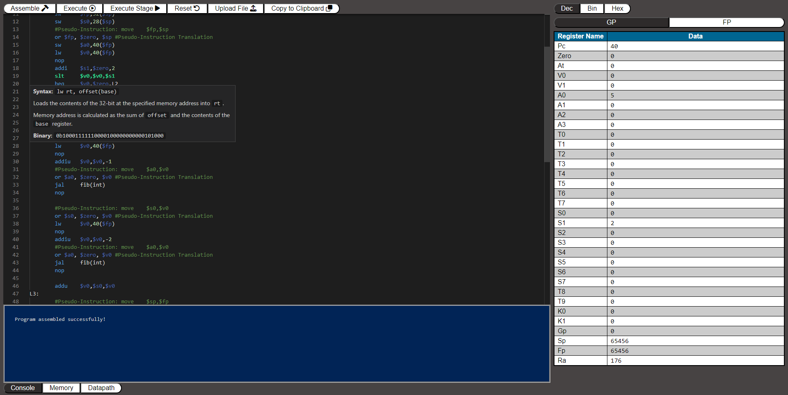

# SWIM (Simple Web Interface for MIPS)

This was originally developed by Kevin Cahalan, Jerrett Longworth, Huy Nguyen, Evan Raiford, and Jimmie Smith at UCF as a senior design project.

A web-based emulator for MIPS64 made for educational purposes. Its emulation core supports over 60 real instructions and 20 pseudo-instuctions and an user interface that provides the following features:
- Step execute and execute code down to the individual [stages](https://en.wikipedia.org/wiki/Instruction_cycle)
- Upload files to SWIM and Copy code to the user's clipboard to be saved locally 
	- Note: For Chromium-based browsers on Mac, the user will have to manually copy-paste the code onto a text editor. This is done as followed:
		1. Click on the Editor window.
		2. Press `(Cmd + A)` to select all text.
		3. Press `(Cmd + C)` to copy the text on your clipboard.
		4. Press `(Cmd + V)` to paste the text in your text editor to save the code.
- A register viewer that displays General Purpose and Floating Point registers with toggling to different views (decimal, binary, hexadecimal, float, double)
- A console viewer to display errors and suggestions on fixing them
- A memory viewer to see the code compiled and updated as it executes
- A visualization of the datapath to see the individual parts that make up the general and floating-point coprocessors and the values inside each wire
- Utilizes the [Monaco Editor](https://microsoft.github.io/monaco-editor/) code library to provide:
	- Syntax highlighting of our custom language
	- Highlighting the previously executed line
	- Providing mouse hover information on instructions and errors
	- Expands the pseudo-instructions into their hardware equivalent upon assembling code

Supported Instructions:
- Conventional Instructions:
	- add
	- addu
	- sub
	- mul
	- div
	- lw
	- sw
	- lui
	- andi
	- ori
	- addiu
	- dadd
	- dsub
	- dmul
	- ddiv
	- or
	- and
	- dahi
	- dati
	- daddi
	- daddiu
	- daddu
	- dsubu
	- dmulu
	- ddivu
	- slt
	- sltu
	- j
	- jr
	- jal
	- jalr
	- beq
	- b
	- bne
	- sll
	- nop
	- syscall `Note: This is currently a stubbed instruction to halt emulation.`

- Floating-Point Instructions:
	- add.s
	- add.d
	- sub.s
	- sub.d
	- mul.s
	- mul.d
	- div.s
	- div.d
	- c.eq.s
	- c.eq.d
	- c.lt.s
	- c.lt.d
	- c.le.s
	- c.le.d
	- c.ngt.s
	- c.ngt.d
	- c.nge.s
	- c.nge.d
	- swc1
	- lwc1
	- mtc1
	- dmtc1
	- bc1t
	- bc1f

Supported Pseudo-instructions:
- li
- move
- seq
- sne
- sle
- sleu
- sgt
- sgtu
- sge
- sgeu
- lw
- sw
- subi
- dsubi
- dsubiu
- muli
- dmuli
- dmuliu
- divi
- ddivi
- ddiviu

Supported .data directives:
- .ascii
- .asciiz
- .byte
- .double
- .float
- .half
- .space
- .word

All of this wholly developed with the [Rust](https://www.rust-lang.org/) language with the interface built with the [Yew](https://yew.rs/) framework which uses [WebAssembly](https://webassembly.org/) and JavaScript to house the emulation core and parser/assembler.

## Compiling

While SWIM is currently being hosted [here](https://swim-ucf.github.io/SWIM/), you can compile and run it locally on your browser as long as it supports WebAssembly.

1. Install the latest stable rust toolchain with `rustup` at https://www.rust-lang.org/tools/install
2. Install [trunk](https://trunkrs.dev/#install)
3. `git clone` the repository or download the source here
4. When you are in the root directory of the project, type `trunk serve --open` in your terminal to load it locally

## Licensing

SWIM is licensed under GNU's GPL-3.0 as shown [here](LICENSE)
